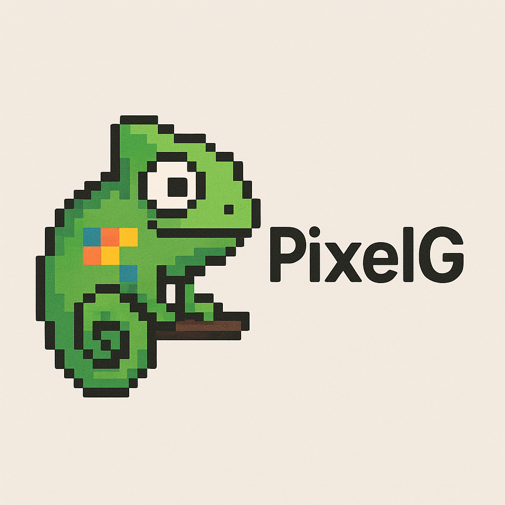

# PixelG  

##

  
  
  
  

## Overview  
PixelG is a web-based tool designed for converting images into pixelated versions, allowing users to adjust resolution and colors. It provides an intuitive and efficient way to create pixel art directly in the browser.  

## Features  
- **Image upload** for pixel conversion  
- **Real-time pixelation adjustment**  
- **Customizable color palette control**  
- **Live preview of pixelated images**  
- **Download option** for the final output  

## Technologies Used  
  
  
  

## How to Use  
1. Open the **PixelG** interface in your browser.  
2. Upload an image.  
3. Adjust pixelation settings.  
4. Preview changes in real-time.  
5. Download the final pixelated image.  

## License  
This project is licensed under the **MIT License**, allowing free use, modification, and distribution.  
##
